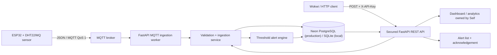

# IoT Device & Backend Capstone

A portfolio-grade ESP32-to-cloud telemetry platform demonstrating device firmware, MQTT ingestion, secured REST APIs, persistent storage, and automatic threshold alerts.

## Features

- ESP32/DHT22 firmware publishes JSON telemetry every five seconds.
- MQTT ingestion subscribes to `iot/+/telemetry` with QoS 1.
- Secured HTTP ingestion supports simulators, testing, and fallback delivery.
- SQLite supports local development; managed PostgreSQL provides durable Vercel storage.
- Configurable temperature, humidity, and gas rules generate alerts immediately.
- The REST API exposes filtered readings, alerts, and acknowledgement state.
- Docker, Render blueprint, automated tests, and GitHub Actions make the service reproducible.

## Architecture



See [ARCHITECTURE.md](ARCHITECTURE.md) for component responsibilities and failure handling, and [PROTOCOL.md](PROTOCOL.md) for the full API and MQTT contract.

## Tech stack

ESP32/Arduino, WiFi, MQTT, JSON, Python 3.12, FastAPI, Pydantic, SQLAlchemy, SQLite/PostgreSQL, Docker, Vercel, Pytest, and GitHub Actions.

## Live links

| Component | Link | Status |
|---|---|---|
| GitHub repository | https://github.com/abijith-123/iot-device-backend-capstone | Live |
| Backend health | https://iot-device-backend-capstone.vercel.app/health | Live and verified |
| Interactive API docs | https://iot-device-backend-capstone.vercel.app/docs | Live and verified |
| Durable database | Neon PostgreSQL through Vercel Marketplace | Live and verified across redeployment |
| ESP32 simulator | Add Wokwi project URL after importing firmware | Pending Wokwi project |
| Dashboard | Seif's dashboard deliverable | Complete by team declaration; link maintained in Seif's submission |

The backend and durable database were independently verified. Seif's dashboard layer is recorded as complete by the team's declaration, with its personal links and evidence owned by Seif's submission. The Wokwi live link is added after the simulator project is saved.

## Production verification — 22 July 2026

- Vercel production deployment reached **Ready** with Neon `DATABASE_URL` connected for Production and Preview.
- `POST /api/v1/telemetry` returned **201** for device `esp32-vercel-e2e`.
- Reading **#1** was stored with temperature `38.5°C`, humidity `55%`, and gas `650 ppm`.
- The alert engine created **high_temperature** and **high_gas** critical alerts at thresholds `35°C` and `500 ppm`.
- After a fresh production redeployment, `GET /api/v1/readings` and `GET /api/v1/alerts` returned the same reading and alerts, proving durable PostgreSQL persistence.
- The API credential was rotated after testing and remains stored only in Vercel environment variables.

## Run locally

```bash
cp .env.example .env
# Replace API_KEY in .env
python -m venv .venv
source .venv/bin/activate
pip install -r requirements.txt
uvicorn backend.app.main:app --reload
```

Open `http://localhost:8000/docs`. Send the configured key in the `X-API-Key` header.

### Docker

```bash
cp .env.example .env
docker compose up --build
```

### Test

```bash
python -m pytest -q
```

## Deploy on Vercel

1. Import this GitHub repository at `vercel.com/new`.
2. Keep the detected Python/FastAPI settings; `app.py` exports the application.
3. Add a PostgreSQL integration from the Vercel Marketplace and connect it to the project.
4. Set `DATABASE_URL` to the provider's pooled PostgreSQL connection string.
5. Add a long random `API_KEY` and keep `MQTT_ENABLED=false` for the serverless API.
6. Deploy, then verify `/health`, `/docs`, ingestion, readings, and alerts.
7. Put the verified URLs in the table above and in both contribution documents.

Never commit the API key or database password. Vercel injects them at runtime.

### MQTT on Vercel

Vercel runs the FastAPI app as an on-demand function, so it cannot maintain a permanent broker subscription. The deployed device path must either post directly to `POST /api/v1/telemetry` or use an MQTT broker rule/webhook that forwards messages to that endpoint. The local/container deployment can still enable the included MQTT worker with `MQTT_ENABLED=true`.

## Ownership

- **Abijith Biju:** firmware, MQTT/HTTP ingestion, persistence, backend API, alert rules, backend deployment materials.
- **Seif Taha:** completed dashboard, analytics presentation, frontend authentication/integration, and dashboard deployment (team declaration; personal evidence remains in Seif's submission).

Shared work includes agreeing on the JSON/API contract, end-to-end testing, and linking the deployed components.
