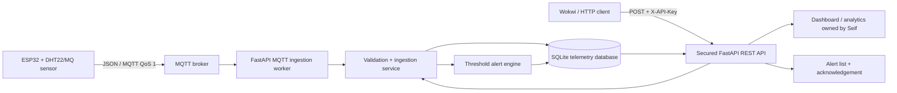

# IoT Device & Backend Capstone

A portfolio-grade ESP32-to-cloud telemetry platform demonstrating device firmware, MQTT ingestion, secured REST APIs, persistent storage, and automatic threshold alerts.

## Features

- ESP32/DHT22 firmware publishes JSON telemetry every five seconds.
- MQTT ingestion subscribes to `iot/+/telemetry` with QoS 1.
- Secured HTTP ingestion supports simulators, testing, and fallback delivery.
- SQLite persistence provides a simple local and free-host deployment path.
- Configurable temperature, humidity, and gas rules generate alerts immediately.
- The REST API exposes filtered readings, alerts, and acknowledgement state.
- Docker, Render blueprint, automated tests, and GitHub Actions make the service reproducible.

## Architecture



See [ARCHITECTURE.md](ARCHITECTURE.md) for component responsibilities and failure handling, and [PROTOCOL.md](PROTOCOL.md) for the full API and MQTT contract.

## Tech stack

ESP32/Arduino, WiFi, MQTT, JSON, Python 3.12, FastAPI, Pydantic, SQLAlchemy, SQLite, Docker, Render, Pytest, and GitHub Actions.

## Live links

| Component | Link | Status |
|---|---|---|
| GitHub repository | https://github.com/abijith-123/iot-device-backend-capstone | Live |
| Backend health | Add Render URL after deployment | Pending host credentials |
| Interactive API docs | Add `<backend-url>/docs` after deployment | Pending host credentials |
| ESP32 simulator | Add Wokwi project URL after importing firmware | Pending Wokwi project |
| Dashboard | Add Seif's deployed dashboard URL | Pending team integration |

Links are intentionally marked pending instead of presenting unverified URLs as live deployments.

## Run locally

```bash
cp .env.example .env
# Replace API_KEY in .env
python -m venv .venv
source .venv/bin/activate
pip install -r requirements.txt
uvicorn backend.app.main:app --reload
```

Open `http://localhost:8000/docs`. Send the configured key in the `X-API-Key` header.

### Docker

```bash
cp .env.example .env
docker compose up --build
```

### Test

```bash
python -m pytest -q
```

## Deploy on Render

1. Fork or use this repository in Render.
2. Choose **New > Blueprint** and select `render.yaml`.
3. Confirm the generated `API_KEY` secret and persistent disk.
4. Deploy, then verify `/health` and `/docs`.
5. Set `MQTT_ENABLED=true` and broker credentials only when the broker is ready.
6. Put the verified URLs in the table above and in both contribution documents.

Never commit the API key or broker password. Render injects these at runtime.

## Ownership

- **Abijith Biju:** firmware, MQTT/HTTP ingestion, persistence, backend API, alert rules, backend deployment materials.
- **Seif Taha:** dashboard, analytics presentation, frontend authentication/integration, dashboard deployment.

Shared work includes agreeing on the JSON/API contract, end-to-end testing, and linking the deployed components.
