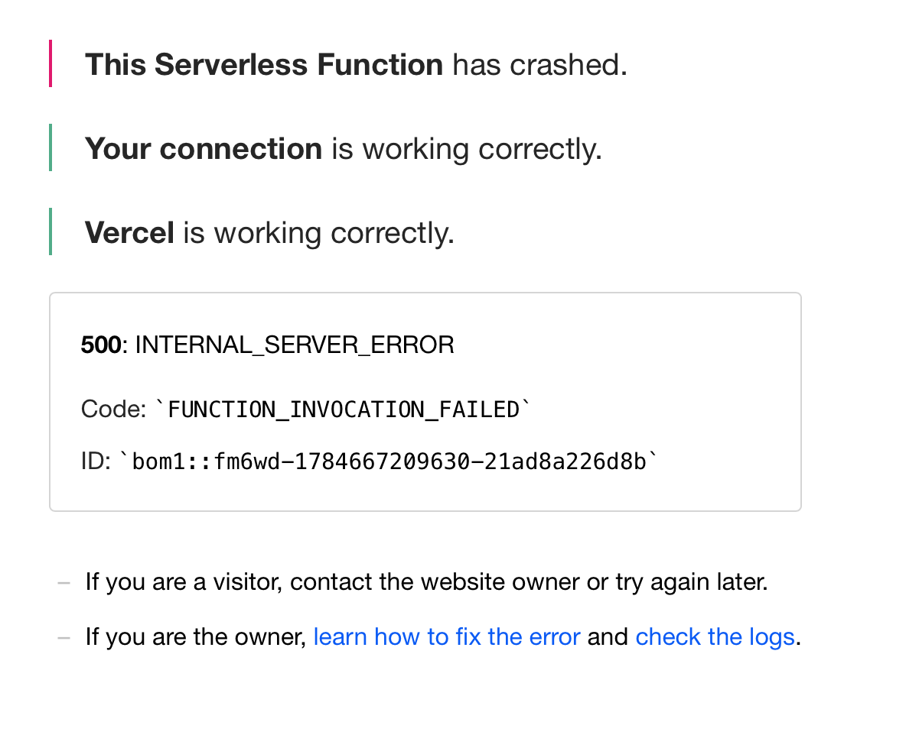
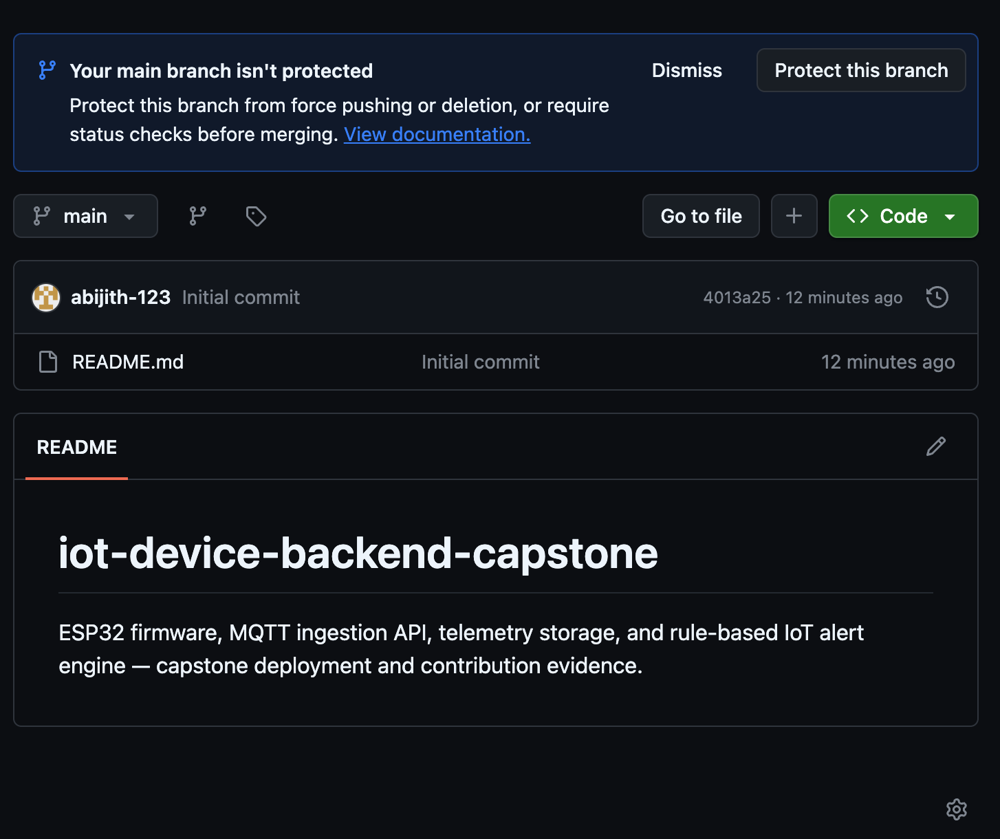
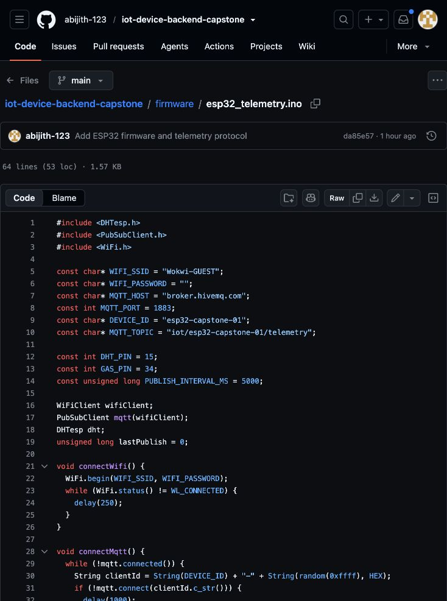
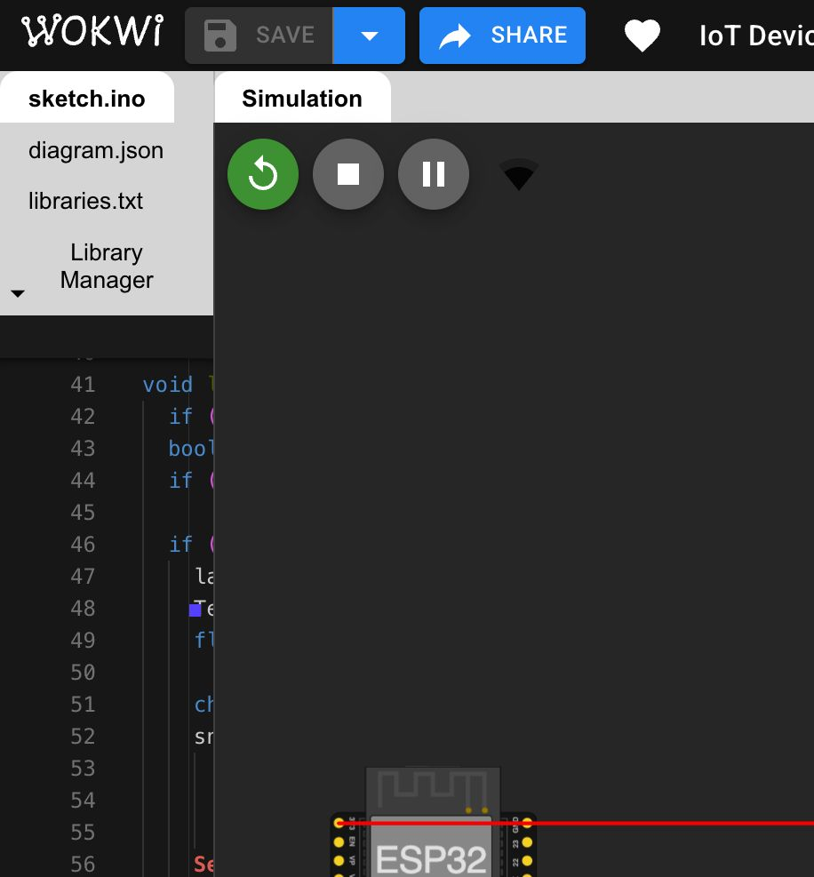
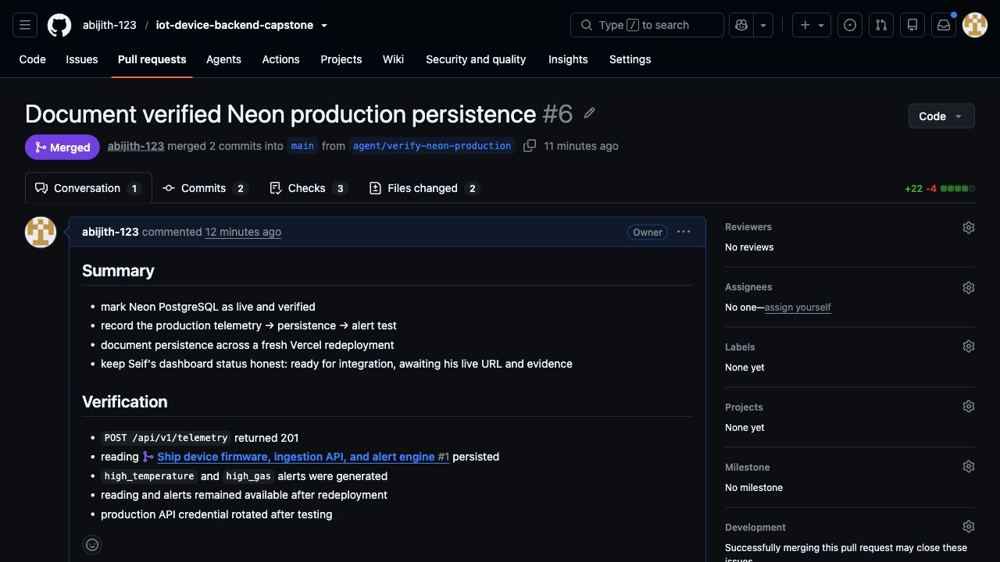
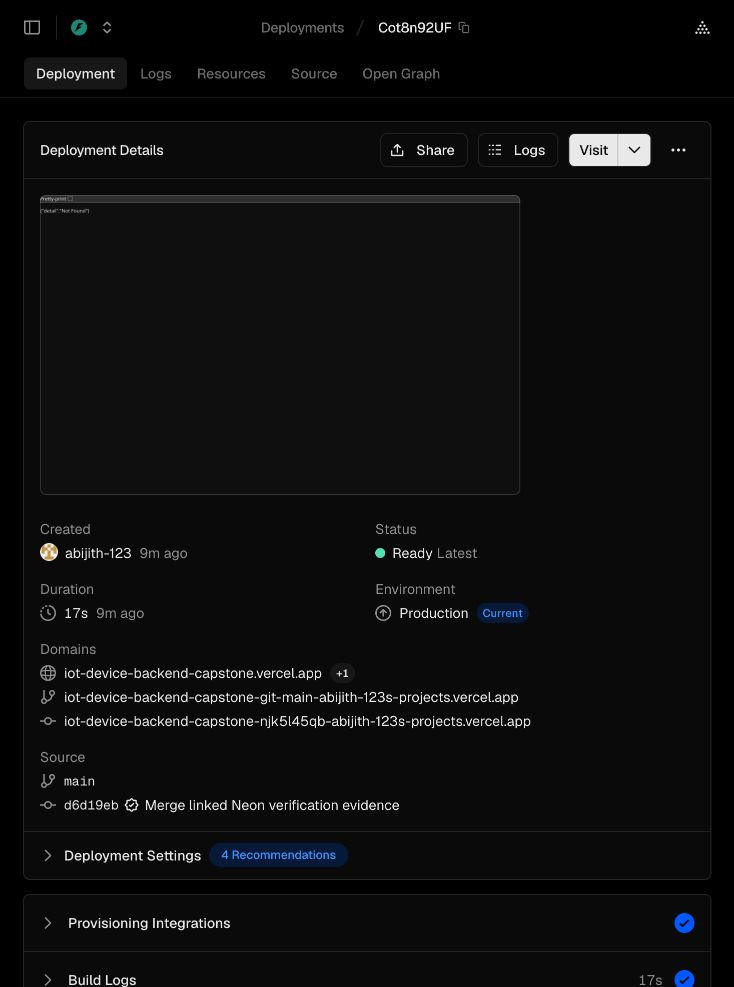
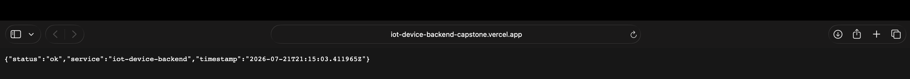
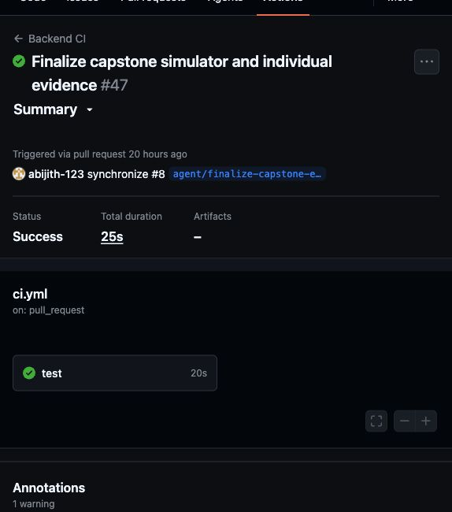

# Annotated Individual Walkthrough — Abijith Biju

This completed evidence set is the submitted screenshot alternative to a 3–5 minute recording. The annotations document the device-to-backend contribution in assessment order.

## 1. Failure discovered before the deployment fix

**Annotation:** The first Vercel invocation returned `FUNCTION_INVOCATION_FAILED`. I traced this to deployment/runtime configuration, added the Vercel Python dependencies and entry point, and replaced temporary serverless storage with managed PostgreSQL.

## 2. Repository and ownership record

**Annotation:** The public repository is the professional evidence record. The firmware, ingestion API, persistence layer, alert engine, deployment configuration, architecture documentation, and personal contribution files are maintained through branches, commits, and pull requests.

## 3. ESP32 firmware and telemetry contract

**Annotation:** The firmware samples a DHT22 and analog gas input every five seconds, reconnects Wi-Fi/MQTT when required, and publishes the agreed JSON fields on `iot/esp32-capstone-01/telemetry`. The live simulator is available at [Wokwi project 470194701675629569](https://wokwi.com/projects/470194701675629569).

## 4. Running Wokwi ESP32 simulation

**Annotation:** The public Wokwi project is actively running—the restart, stop, and pause controls are visible with the ESP32 circuit. The simulator configuration keeps the Serial Monitor open, and the firmware prints each telemetry JSON payload locally before attempting MQTT delivery, so evidence remains observable even when the public broker is temporarily unavailable.

## 5. Merged production-verification pull request

**Annotation:** PR #6 records the production telemetry → persistence → alert test. It merged two commits into `main` after CI, documenting a `201` ingestion result, stored reading, two critical alerts, and durable data across redeployment.

## 6. Ready Vercel production deployment

**Annotation:** Vercel shows the `main` deployment as **Ready**, **Production**, and **Current**, with the public project domain assigned. Neon `DATABASE_URL` is connected through Vercel environment variables.

## 7. Public health check after the fixes

**Annotation:** The final `/health` response reports `status: ok` for `iot-device-backend`, proving that the production function is reachable independently of the authenticated telemetry routes.

## 8. Passing backend continuous integration

**Annotation:** GitHub Actions run #47 completed with **Success**. The backend test job passed in 20 seconds before the final evidence pull request was merged, providing an independent, repeatable check of the submitted code.

## Contribution boundary

I owned ESP32 firmware through ingestion, persistence, the secured API, alert generation, testing, and backend deployment. Seif completed the dashboard, analytics, and frontend authentication layer. We collaborated on the JSON/API boundary and final integration contract.
